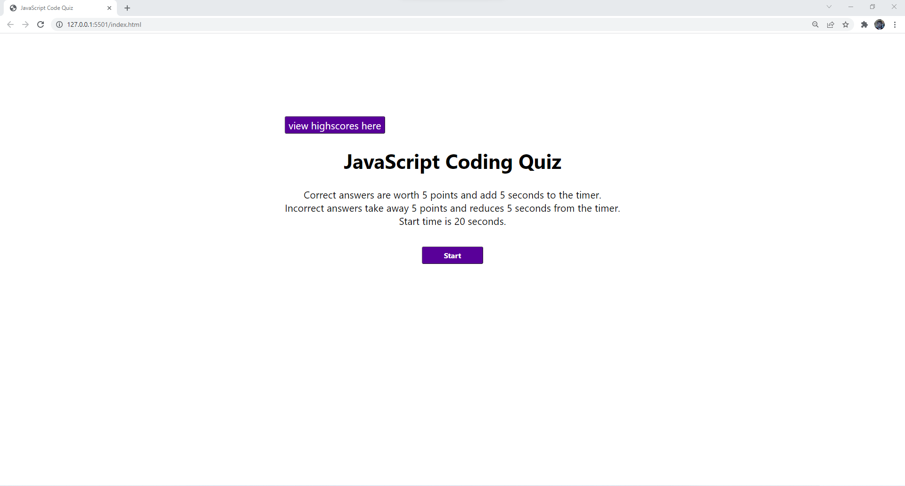
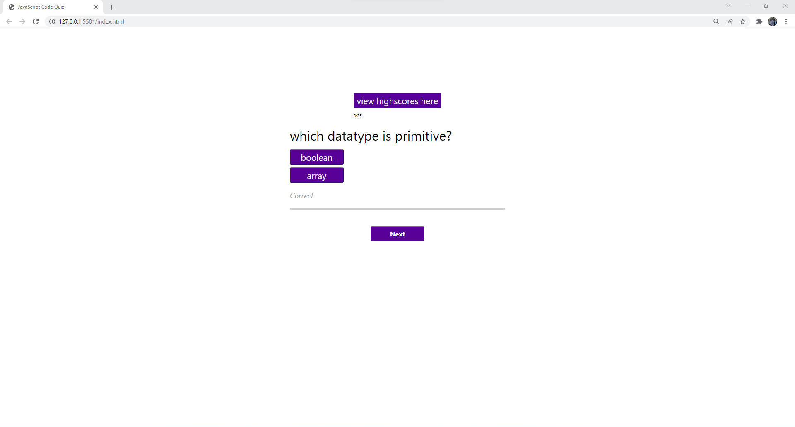

# JS-101-code-quiz
A code quiz on JavaScript fundamentals

## About
A quiz on the fundamentals of JavaScript

The webpage includes:
- A highscores system using local storage
- one page application using buttons
- Dynamic creation of HTML elements via JS
- Feedback for correct/incorrect responses 

## Screenshots
Link: [JS-Quiz link](https://jameshardin02.github.io/JS-101-code-quiz/).

